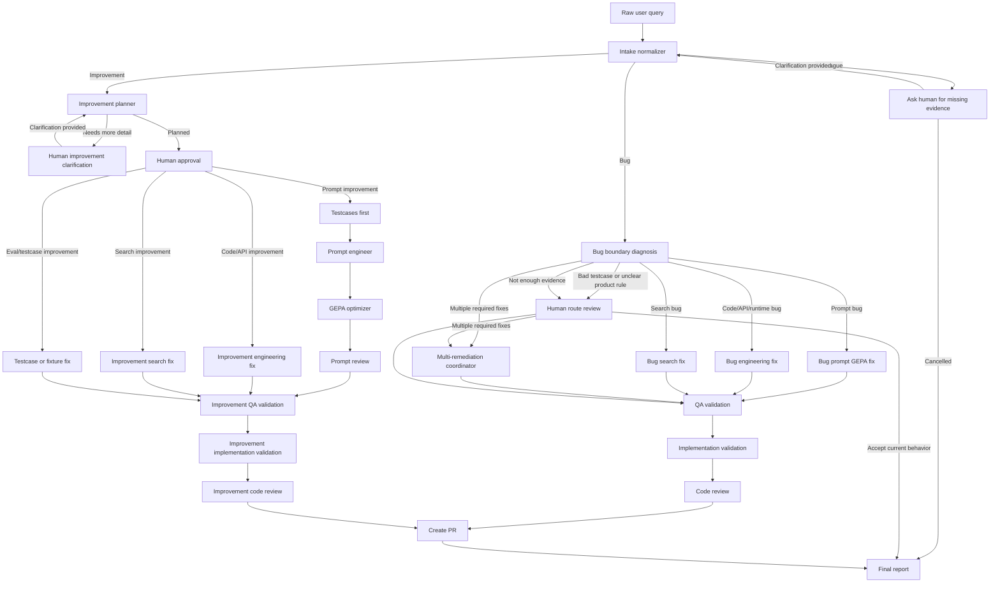
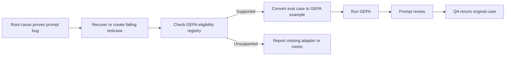
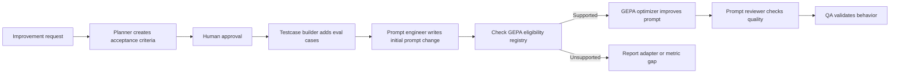

# Inomy AI Service Issue Remediation Flow

This document explains the `inomy-ai-service-issue-remediation-v1` workflow in plain language. It handles bugs, improvements, prompt/testcase work, code/API issues, search issues, and runtime evidence for `inomy-ai-service`.

The simplest way to think about it:

1. A person describes a problem or improvement in normal language.
2. Allen turns that into structured evidence.
3. Allen decides whether this is a bug or an improvement.
4. The workflow chooses the right specialist path, or an ordered multi-part plan when one issue needs several fixes.
5. Changes are made in a branch, verified, reviewed, and prepared for a pull request.

## What You Type In

The run form now needs one field:

```json
{
  "raw_user_query": "The product agent returns unrelated results for Dyson hair dryer searches."
}
```

You can also paste richer evidence into the same field, such as:

- trace ID, chat ID, conversation ID, or thread ID,
- failed eval case or eval report path,
- exact query that failed,
- expected behavior,
- actual behavior,
- API request and response,
- search result examples,
- logs or screenshots,
- target agent or affected component.

If the request is too vague, the workflow pauses and asks for clarification. The clarification can ask for any missing evidence, not only a chat ID.

## Runtime Defaults

The workflow input schema owns these runtime defaults. Allen applies them before the intake node runs, so agents receive the same values whether the workflow is started from the UI or API.

For the deployed dev Allen workflow, the defaults are:

| Item | Default |
| --- | --- |
| Primary repo | `/home/ubuntu/.allen/repositories/inomy-ai-service` |
| Search repo | `/home/ubuntu/.allen/repositories/inomy-mono` |
| Dev API base for canonical/legacy replay | `https://api.dev.inomy.shop/api/v1` |
| Go search-lite endpoint | `http://internal-inomy-search-lite-dev-1599955105.us-east-1.elb.amazonaws.com/search/os/get-matches` |
| GEPA iterations | `3` |
| Routing confidence | `0.7` |
| Repo changes | allowed |
| Direct prompt DB mutation | disabled |
| Prompt best-practice reference | `/home/ubuntu/.allen/repositories/allen/docs/claude-prompting-best-practices.md` |

Prompt changes are repo-backed. The workflow should not directly mutate production prompt storage.

Do not place API tokens in workflow input. The dev API can require authentication, so replay through the `api-caller` MCP server when auth is needed; that server injects its auth header from its own environment. The search-lite default is an internal ALB URL and must be reachable from the Allen runtime network.

On a workstation, the registered Allen repo paths may be under `/Users/apple/.allen/repositories`. The shorter `/Users/apple/inomy/inomy-ai-service` and `/Users/apple/inomy/inomy-mono` paths are local symlinks to those registered repos, so either form resolves to the same working tree.

## Big Picture



## How The Workflow Decides The Route

The intake node only answers: is this a bug, an improvement, or too vague?

For bugs, the root-cause agent first looks for the broken boundary in this order:

1. Testcase, rubric, or product expectation validity.
2. Agent inputs and fixtures.
3. Rendered prompt, context, and tool instructions.
4. Raw LLM output.
5. Parser, output model, or wrapper code.
6. Tool/API/search request emitted by `inomy-ai-service`.
7. Upstream API/search/data response.
8. Runtime trace, session, or conversation state.

This matters because a failed eval is evidence, not automatic proof of a prompt bug. The workflow should not edit a prompt if the real issue is a bad testcase, wrong search response, broken API contract, or stale runtime state.

If fixing the first broken boundary is not enough to make the original user-visible bug pass, the diagnosis agent can choose `multi_remediation`. That route is for cases where the evidence proves multiple fix parts are required, for example:

- a prompt fix plus parser/code fix,
- a tool schema fix plus search-lite parity fix,
- a testcase/rubric correction plus production code fix,
- a runtime/session fix plus API contract fix.

The diagnosis agent must then produce an ordered `remediation_plan`. Each plan item names the route, owning repo or component, evidence, dependency order, intended change, and validation criteria. Speculative secondary causes stay in `secondary_causes`; they do not become multi-remediation items unless evidence proves they must be fixed.

For improvements, the planner turns the request into measurable acceptance criteria and chooses one path:

- prompt improvement,
- code/API/tool/schema improvement,
- search/search-tool improvement,
- testcase/fixture/eval improvement,
- human review.

Human approval happens before improvement changes are made.

## Prompt Bug Flow

Prompt bugs follow this path:



The GEPA bridge and eligibility registry live in:

```text
/Users/apple/inomy/inomy-ai-service/app/utils/prompt_optimization/eval_bridge.py
/Users/apple/inomy/inomy-ai-service/app/utils/prompt_optimization/optimization_registry.py
```

It converts `evals/per_agent` testcases and eval records into GEPA examples. It preserves strict expected fields and also carries rubric checks for qualitative behavior.

Before running GEPA, the optimizer must ask the bridge for the current readiness report instead of relying on a hand-written list:

```bash
cd /Users/apple/inomy/inomy-ai-service
venv/bin/python -m app.utils.prompt_optimization.eval_bridge --list-agents
```

That report covers every per-agent eval target and returns:

- whether GEPA can run for the agent,
- the registered prompt path, adapter, and metric,
- deterministic rubric coverage from the eval datasets,
- the reason an agent is gated,
- the next adapter or metric needed to make that agent GEPA-ready.

Important distinction:

- **Eval-supported** means the workflow can run that agent and judge whether it passed.
- **GEPA-supported** means the workflow can safely mutate that agent's prompt, rerun candidate prompts, and score them with a known adapter and metric.

At the time of this audit, the readiness command marks these agents as GEPA-supported:

| Agent | Why it is supported |
| --- | --- |
| `query_understander` | Single classification prompt with a dedicated metric. |
| `clarification_finder` | Single classification prompt with a dedicated metric. |
| `guidance_detector` | Single classification prompt with a dedicated metric. |
| `bundle_query_understander` | Single bundle intent prompt with generic structured JSON scoring. |

Other per-agent eval agents are still useful for diagnosis, QA, and regression testing. They are intentionally gated from automatic GEPA until an adapter and metric exist. This is not because their evals are useless; it is because the current GEPA adapter runs one prompt directly, while many evals judge the full production boundary after code, tools, search APIs, state mutation, product fixtures, or response assembly have run.

Common gated families:

| Family | Why GEPA is gated today |
| --- | --- |
| Parser agents | Need a parser-family adapter that injects the same cheatsheet/buying-guide context as production and scores parser JSON fields. |
| Search/data-fetching agents | Need a tool-call adapter that captures request bodies, tool arguments, and search/API replay evidence. |
| Selection agents | Need product fixture replay and ranking metrics. |
| Response agents | Need stable fixtures plus narrow judge/programmatic metrics for final text and product cards. |
| Bundle mutation/suggestion/budget skills | Their evals judge full state mutations and final responses; the single-prompt GEPA adapter only sees the internal LLM subprompt output. |

If GEPA is unsupported for the target agent, the workflow should not stop the whole remediation. It should route to prompt engineering, code/API/search remediation, testcase repair, or an explicit improvement to add the missing GEPA adapter.

## Multi-Part Bug Flow

Multi-part bugs follow this path:

```mermaid
flowchart LR
  A[Diagnosis finds more than one required fix] --> B[Build ordered remediation plan]
  B --> C[Multi-remediation coordinator]
  C --> D[Fix plan item 1]
  D --> E[Fix dependent items]
  E --> F[Combined validation plan]
  F --> G[QA validates every item and original bug]
  G --> H[Implementation validation]
  H --> I[Code review]
  I --> J[Create one or more PRs]
```



For a non-technical reader: this is the "one problem, several repairs" lane. Instead of pretending the issue belongs to only prompt, code, or search, Allen writes a checklist of required repairs, performs them in the correct order, and validates that the original issue now works end to end.

The coordinator returns both:

- per-item results, so reviewers can see exactly what happened for each fix part,
- aggregate fields, so the existing QA, review, and PR nodes can continue to work.

If all changes are in one repo, the PR node prefers one PR. If the fix spans repos such as `inomy-ai-service` and `inomy-mono`, it prepares separate PRs and reports all URLs.

## Prompt Improvement Flow

Prompt improvements are testcase-first:



This is intentionally different from directly editing a prompt. The workflow first makes the desired behavior testable, then uses prompt engineering and GEPA to improve it.

If the prompt belongs to a GEPA-gated agent, the prompt engineer can still make a repo-backed prompt change and QA can still rerun the per-agent eval. The automatic GEPA loop only runs after `optimization_registry.py` says the agent has a complete prompt path, adapter, and metric.

## Fuzzy Eval Criteria

Not every useful eval is exact JSON equality. The workflow now supports a mixed scoring model:

- exact fields for stable labels, booleans, enums, and required values,
- programmatic rubric checks such as contains-any and max-token limits,
- narrow LLM-judge checks when behavior is qualitative.

Examples:

| Requirement | Better check |
| --- | --- |
| `query_type` must be discovery | exact field equality |
| response should mention video editing | contains-any check |
| answer should not be too verbose | token or word count |
| recommendations should be relevant | narrow judge rubric |

Broad judge failures are treated as evidence to investigate. They should not automatically trigger prompt changes.

For GEPA, subjective judge-only criteria are not enough by themselves. The bridge carries them for auditability, but GEPA needs at least one stable scoring signal: exact fields, compiled rubric checks, or a narrow configured judge metric. This prevents the optimizer from chasing noisy or ambiguous feedback.

## Search Issues

Search issues are split carefully:

1. Did the agent intend the right search?
2. Did `inomy-ai-service` emit the correct request body?
3. Did legacy NestJS return the expected result?
4. Did Go search-lite return something different?
5. Is the catalog/index/config data itself wrong?

If legacy or canonical evidence is correct and Go search-lite differs for the same payload, the fix belongs in:

```text
/Users/apple/.allen/repositories/inomy-mono/apps/search-lite
```

The deployed dev replay endpoints are:

```text
Dev API base:   https://api.dev.inomy.shop/api/v1
Go search-lite: http://internal-inomy-search-lite-dev-1599955105.us-east-1.elb.amazonaws.com/search/os/get-matches
```

## Agents Updated For This Flow

The workflow uses Opus-class Claude agents through Allen. The prompt review pass aligned the workflow-specific agents with `/Users/apple/allen/docs/claude-prompting-best-practices.md`.

Key agents:

| Agent | Responsibility |
| --- | --- |
| `inomy-bug-intake-normalizer` | Turns raw text into bug/improvement/clarification input. |
| `inomy-bug-root-cause-agent` | Finds the first broken boundary for bug reports. |
| `inomy-bug-multi-remediation-coordinator` | Executes ordered multi-part bug fixes when one issue requires several coordinated repairs. |
| `inomy-bug-gepa-prompt-optimizer` | Builds or recovers failing prompt testcases and runs GEPA. |
| `inomy-bug-gepa-prompt-reviewer` | Reviews bug prompt candidates for safety and overfitting. |
| `inomy-improvement-planner` | Converts improvement requests into measurable plans. |
| `inomy-improvement-prompt-testcase-builder` | Creates testcases before prompt improvement work. |
| `inomy-improvement-prompt-engineer` | Writes repo-backed prompt improvements. |
| `inomy-improvement-gepa-optimizer` | Runs GEPA for prompt improvements. |
| `inomy-improvement-prompt-reviewer` | Reviews prompt improvements. |
| `inomy-improvement-qa-validator` | Validates improvements with tests, APIs, search, and evals. |

## Tools And MCP Readiness

The workflow context declares these tool surfaces:

- filesystem,
- git,
- terminal,
- LangSmith,
- flow-tester,
- api-caller,
- OpenSearch,
- Postgres,
- DocumentDB.

The improvement QA agent was aligned with the bug QA tool surface so it can validate live APIs, search, OpenSearch, Postgres, DocumentDB, and flow-tester evidence.

Runtime checks that may be needed depending on the issue:

| Need | Required |
| --- | --- |
| Trace or chat diagnosis | LangSmith MCP credentials and trace access |
| API replay | local API server or reachable deployed API |
| Search parity | legacy NestJS endpoint and Go search-lite endpoint |
| OpenSearch evidence | OpenSearch env and reachable index |
| GEPA/prompt evals | model keys required by the prompt optimizer; `GPT_API_KEY`; optional `GPT_API_ENDPOINT` or `AZURE_OPENAI_ENDPOINT`; optional `GPT_API_MODEL` or `AZURE_OPENAI_DEPLOYMENT` |
| Repo-backed fixes | registered repos under `/Users/apple/.allen/repositories` |

If an issue does not require live replay, the workflow can still proceed with repo tests and provided evidence.

## Validation And End States

The workflow should only claim success when:

- the original reproduction or exact failed eval case was rerun when feasible,
- every required multi-remediation plan item is fixed or explicitly proven unnecessary after a prior fix,
- focused regression tests passed,
- implementation validation says the root cause was actually addressed,
- code review approved the diff,
- a PR was created or a PR-ready package was prepared.

End states:

| End State | Meaning |
| --- | --- |
| `success` / `completed` | Verified and reviewed change reached PR or PR-ready state. |
| `partial_success` | Some work completed, but follow-up remains. |
| `human_review_needed` / `blocked` | More evidence or a product decision is needed. |
| `cancelled` | A human cancelled the run. |
| `failed` | The workflow could not complete safely. |

## How To Run It

In Allen, start workflow:

```text
inomy-ai-service-issue-remediation-v1
```

Provide `raw_user_query`. The other runtime fields are optional and defaulted by the workflow input schema:

```json
{
  "raw_user_query": "Trace abc123 returned unrelated products for a Dyson hair dryer query."
}
```

Override runtime values only when you intentionally want a non-default repo or replay endpoint:

```json
{
  "raw_user_query": "Search-lite returns 4 variants but legacy returns 10 for this payload.",
  "search_lite_base_url": "http://internal-inomy-search-lite-dev-1599955105.us-east-1.elb.amazonaws.com/search/os/get-matches",
  "old_search_api_base_url": "https://api.dev.inomy.shop/api/v1"
}
```

Good examples:

```text
Trace abc123 returned unrelated products for a Dyson hair dryer query. Expected only Dyson hair dryers, actual results included unrelated electronics.
```

```text
Improve query_understander so laptop searches for video editing do not ask unnecessary clarification questions. Add eval coverage first.
```

```text
Search-lite returns 4 variants for this payload, but the canonical dev API returns 10. Use the default dev replay endpoints.
```

If the request is too short, Allen will ask for the missing evidence before it edits anything.
